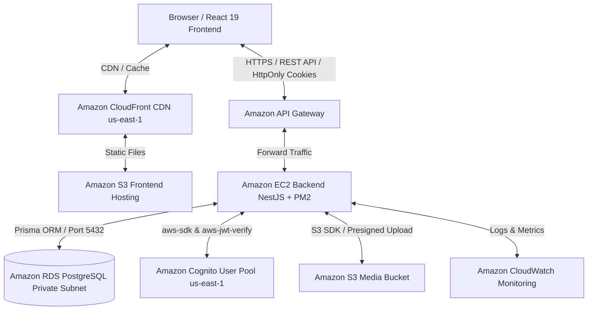

# Startups Blogs - Business Investment Connection Platform
## A Unified Platform for Startup & Business Investment Connection

---

### 1. Executive Summary
**Startups Blogs** is a modern web application designed to bridge the connection gap between Startups, Small and Medium Enterprises (SMEs), Business Owners, Investors, and Enterprise Partners.

The platform enables businesses to build detailed identity profiles, publish funding opportunities, clarify use-of-fund roadmaps, and attract capital. Simultaneously, investors can effortlessly discover, filter, and evaluate investment opportunities through a clean, structured interface.

The project has established a full-stack enterprise architecture with **React 19 (Vite, TypeScript)** on the frontend, **NestJS (REST API, TypeScript)** on the backend, **PostgreSQL & Prisma ORM** at the data layer, and integrated cloud infrastructure on **AWS (Region: `us-east-1`)** fully automated using **Terraform (Infrastructure as Code)**.

---

### 2. Problem Statement

#### Current Challenges
- **Fragmented Investment Information**: Startups and SMEs face difficulties connecting with suitable investors. Business information and funding requirements are often scattered across social media, spreadsheets, and private channels.
- **Unstructured Evaluation Data**: Investors lack a centralized, standardized platform to search, compare, and evaluate financial highlights, founding teams, and deal parameters.
- **Security & Authorization Risks**: Investment documents contain restricted data requiring strict authentication and fine-grained access control.

#### Proposed Solution
**Startups Blogs** provides a centralized ecosystem:
- **Businesses**: Register accounts, verify email, manage business identities, publish funding opportunities, and present capital requirements.
- **Investors**: Register investor accounts, explore business listings, filter opportunities by industry/stage/amount, and review structured data.
- **Administrators & Moderation**: Log in with `ADMIN` privileges synchronized via Cognito Groups to approve business profiles, manage articles, and process Change Proposals.
- **Security Architecture**: Utilizes **Amazon Cognito (`us-east-1`)**, **HttpOnly Cookies**, and **JWT Verification (`aws-jwt-verify`)** at NestJS backend for session security.

---

### 3. Expected Benefits
- **Streamlined Connection**: Reduces match-making time between startups and investors via smart search and filtering.
- **Transparent Profiles**: Standardizes business overview data, Use of Funds breakdown, and Financial Highlights.
- **Enterprise-Grade Security**: Delegating authentication to Amazon Cognito eliminates local password storage risks and protects against XSS/CSRF via HttpOnly cookies.
- **Automated Infrastructure**: 100% of AWS infrastructure is declared via Terraform IaC, enabling rapid environment replication.

---

### 4. Solution Architecture

#### End-to-End Data & Security Flow
1. **Frontend Delivery**: Users navigate to the website; **Amazon CloudFront CDN** serves static React 19 files cached from the **S3 Frontend Bucket**.
2. **Identity Authentication**: Upon login, NestJS calls **Amazon Cognito User Pool (`us-east-1`)** via `USER_PASSWORD_AUTH` with `SECRET_HASH` (HMAC-SHA256). Cognito issues JWT tokens stored securely in **HttpOnly Signed Cookies**.
3. **API Routing**: API requests pass through **Amazon API Gateway** to the backend **EC2** instance running NestJS within a custom **Amazon VPC**.
4. **Database Security**: EC2 communicates with **Amazon RDS PostgreSQL** in a Private Subnet, completely hidden from public Internet access.
5. **Monitoring & Logging**: All system logs and metrics are collected by **Amazon CloudWatch** with SNS email alert triggers.

---

### 5. Technology Stack

#### Frontend (Implemented & Verified)
- **React 19**, **TypeScript**, **Vite**
- **React Router v7** navigation
- **Zustand (`authStore`, `businessStore`)** state management
- **CSS Modules** styling
- **Axios Interceptors** for token management and error handling

#### Backend (Implemented & Verified)
- **NestJS**, **TypeScript**
- **Prisma ORM** for PostgreSQL data mapping
- **@aws-sdk/client-cognito-identity-provider** & **aws-jwt-verify**
- **@aws-sdk/client-s3** image uploads
- **Passport JWT** & **Cognito Groups Service** for `ADMIN` role synchronization

#### AWS Infrastructure & IaC (Implemented & Verified)
- **Terraform (IaC)**: Complete AWS infrastructure code inside `terraform/` (Region: `us-east-1`).
- **Amazon Cognito (`us-east-1`)**: User Pools, App Client, Email OTP, Cognito Groups `ADMIN`.
- **Amazon S3 & CloudFront**: Static frontend hosting and media storage (`POST /upload`).
- **Amazon API Gateway**: Secure API entry point and routing.
- **Amazon EC2 & RDS PostgreSQL**: Application compute and relational database in private subnets.
- **Amazon CloudWatch**: Monitoring logs, CPU/memory metrics, and SNS notifications.

---

### 6. Implementation Status Breakdown

| Feature / Module | Implementation Status | Notes |
| --- | :---: | --- |
| Terraform IaC (VPC, EC2, RDS, Cognito, S3, CloudFront, CloudWatch) | **IMPLEMENTED & VERIFIED** | Terraform code located in `terraform/`, Region `us-east-1` |
| PostgreSQL Database & Prisma Schema | **IMPLEMENTED & VERIFIED** | Schema created for User, Business, Article, Funding, Follow, Bookmark, Proposal |
| Business Write & Read APIs (CRUD Businesses) | **IMPLEMENTED & VERIFIED** | `POST /businesses`, `GET /businesses`, `PUT /businesses/:id`, `DELETE /businesses/:id` |
| Funding Opportunity Write APIs | **IMPLEMENTED & VERIFIED** | `POST`, `GET`, `PUT`, `DELETE` at `/businesses/:businessId/funding-opportunities` |
| S3 Media Uploads (`POST /upload`) | **IMPLEMENTED & VERIFIED** | Uses `@aws-sdk/client-s3`, validates file types, returns public image URLs |
| Amazon Cognito Auth & Groups | **IMPLEMENTED & VERIFIED** | Register, Login, Email Verification, Session Refresh, Logout, Cognito Group `ADMIN` sync |
| HttpOnly Signed Cookies & JWT Guard | **IMPLEMENTED & VERIFIED** | Cryptographic RSA token verification via `aws-jwt-verify` against JWKS `us-east-1` |
| Admin Dashboard & Moderation | **IMPLEMENTED & VERIFIED** | Business approval (`PUT /businesses/admin/:id/status`), overview stats, article moderation |
| Change Proposals Workflow | **IMPLEMENTED & VERIFIED** | `ChangeProposal` model allows Admin proposals and Owner Diff/Merge approval |
| Contact Requests | **IMPLEMENTED & VERIFIED** | `POST /businesses/:businessId/contact-requests` sends messages to founders |
| Real-time Notification System | **PLANNED** | UI mocks present, backend Notification Schema & WebSocket/polling planned |
| Advanced Funding Approval Workflow | **PLANNED** | Refinements for multi-tier deal approval |
| E2E Test Suite Expansion | **PLANNED** | Expanding automated end-to-end integration tests |

> **Note on ADMIN role**: Public self-registration is strictly restricted to `BUSINESS_OWNER`, `INVESTOR`, and `ENTERPRISE_PARTNER`. `ADMIN` accounts are managed internally and synchronized with Cognito User Pool Group `ADMIN` via `CognitoGroupsService`.

---

### 7. Security Requirements
1. **No Password Storage in DB**: User credentials managed exclusively by Amazon Cognito.
2. **Server-Side Secret Protection**: `COGNITO_CLIENT_SECRET` stays on NestJS backend; uses HMAC-SHA256 `SECRET_HASH`.
3. **HttpOnly Cookie Protection**: Auth tokens stored in HttpOnly signed cookies to mitigate XSS attacks.
4. **Dual-Layer Authorization**: All write operations verify JWT identity and resource ownership (`ownerId`).
5. **Zero Credential Exposure**: `.env` parameters, AWS Account IDs, and secrets are strictly excluded from repository documentation.

---

### 8. Cost Considerations
> **Notice**: Final production costs will be calculated using the **AWS Pricing Calculator** based on the infrastructure configured in `us-east-1`.

AWS services include:
- **Amazon Cognito**: Free tier includes 50,000 MAUs.
- **Amazon EC2 & RDS**: Utilizing `t3.micro` / `db.t3.micro` for development environments.
- **Amazon S3 & CloudFront**: Billed per storage volume and data transfer.

---

### 9. Risk Assessment

| Risk | Severity | Mitigation Strategy |
| --- | :---: | --- |
| Credential / Token Theft | **High** | Delegate auth to Amazon Cognito & use HttpOnly signed cookies |
| Spam Account Registration | **Medium** | Require 6-digit email verification via Cognito & enforce Rate Limiting |
| Unauthorized Data Modification | **High** | Enforce `JwtAuthGuard` & verify `ownerId` on Backend Controllers |
| Cloud Infrastructure Drift | **Low** | Automate 100% of AWS infrastructure using Terraform IaC |

---

### 10. Expected Outcomes
- Delivers a standardized investment connection platform for Startups and SMEs.
- Demonstrates a complete enterprise AWS cloud architecture: Terraform IaC, Amazon Cognito, EC2, RDS PostgreSQL, API Gateway, S3, CloudFront, and CloudWatch.
- Ensures high security, operational stability, and production deployment readiness.