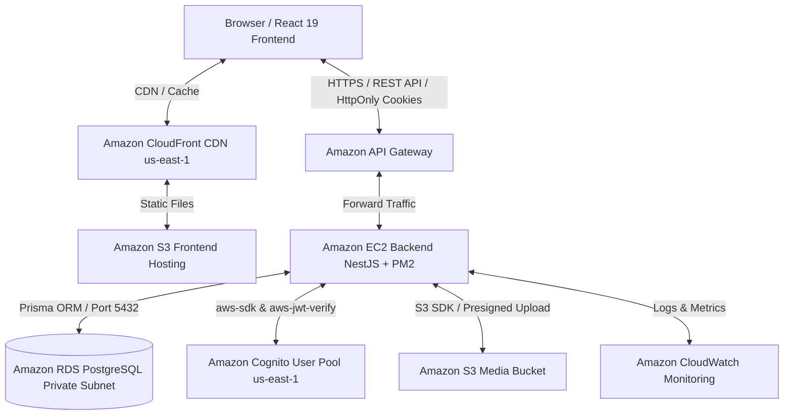

# Startups Blogs - Business Investment Connection Platform
## Nền tảng Kết nối Đầu tư và Quảng bá Doanh nghiệp Khởi nghiệp

---

### 1. Tóm tắt điều hành (Executive Summary)
**Startups Blogs** là một nền tảng ứng dụng web hiện đại được thiết kế nhằm thu hẹp khoảng cách kết nối giữa các Doanh nghiệp khởi nghiệp (Startups), Doanh nghiệp vừa và nhỏ (SMEs), Chủ doanh nghiệp (Business Owners) với các Nhà đầu tư (Investors) và Đối tác chiến lược (Enterprise Partners).

Hệ thống cho phép các doanh nghiệp tạo lập hồ sơ năng lực, công bố các cơ hội gọi vốn (Funding Opportunities), minh bạch hóa lộ trình sử dụng vốn và thu hút dòng vốn đầu tư. Đồng thời, nhà đầu tư có thể dễ dàng tìm kiếm, lọc và đánh giá các cơ hội đầu tư tiềm năng thông qua giao diện trực quan và dữ liệu được cấu trúc chuẩn hóa.

Dự án hiện đã hoàn thiện kiến trúc Full-Stack Enterprise với **React 19 (Vite, TypeScript)** ở Frontend, **NestJS (REST API, TypeScript)** ở Backend, **PostgreSQL & Prisma ORM** ở tầng dữ liệu, kết hợp hạ tầng đám mây **AWS (Region: `us-east-1`)** được tự động hóa hoàn toàn bằng **Terraform (Infrastructure as Code)**.

---

### 2. Tuyên bố vấn đề (Problem Statement)

#### Vấn đề hiện tại
- **Phân mảnh thông tin gọi vốn**: Các doanh nghiệp khởi nghiệp và doanh nghiệp vừa và nhỏ gặp nhiều khó khăn trong việc tiếp cận nhà đầu tư phù hợp. Thông tin doanh nghiệp và nhu cầu gọi vốn thường bị phân mảnh rải rác trên mạng xã hội, trang tin cá nhân, tệp bảng tính hoặc các kênh trao đổi riêng tư.
- **Thiếu cấu trúc dữ liệu đánh giá**: Nhà đầu tư thiếu một nền tảng tập trung, chuẩn hóa để tra cứu, so sánh và đánh giá các chỉ số tài chính, đội ngũ sáng lập cũng như cơ hội đầu tư.
- **Rủi ro an toàn thông tin & Phân quyền**: Thông tin đầu tư và tài liệu doanh nghiệp chứa nhiều thông tin nhạy cảm. Hệ thống cần giải pháp xác thực và phân quyền nghiêm ngặt để bảo vệ tài liệu hạn chế.

#### Giải pháp đề xuất
**Startups Blogs** cung cấp một nền tảng tập trung nơi:
- **Doanh nghiệp**: Đăng ký tài khoản, xác thực email, quản lý hồ sơ doanh nghiệp, công bố cơ hội gọi vốn, lập kế hoạch sử dụng vốn và tiếp cận nhà đầu tư.
- **Nhà đầu tư**: Đăng ký tài khoản nhà đầu tư, tra cứu danh sách doanh nghiệp, lọc cơ hội gọi vốn theo ngành nghề, quy mô vốn, giai đoạn phát triển và xem thông tin minh bạch.
- **Quản trị viên & Phê duyệt**: Đăng nhập quản trị với quyền `ADMIN` được đồng bộ qua Cognito Groups để duyệt hồ sơ doanh nghiệp, quản lý bài viết và xử lý các đề xuất thay đổi (Change Proposals).
- **Bảo mật hệ thống**: Tận dụng dịch vụ **Amazon Cognito (`us-east-1`)** kết hợp với **HttpOnly Cookies** và **JWT Verification (`aws-jwt-verify`)** tại NestJS backend để đảm bảo an toàn tuyệt đối cho phiên làm việc.

---

### 3. Lợi ích giải pháp (Expected Benefits)
- **Tối ưu hóa thời gian kết nối**: Rút ngắn thời gian tiếp cận giữa doanh nghiệp và nhà đầu tư nhờ hệ thống tra cứu và lọc thông tin thông minh.
- **Minh bạch hóa hồ sơ đầu tư**: Chuẩn hóa dữ liệu hồ sơ doanh nghiệp, danh mục sử dụng vốn (Use of Funds) và điểm tin tài chính (Financial Highlights).
- **Bảo mật cấp doanh nghiệp**: Ủy quyền xác thực người dùng cho Amazon Cognito giúp loại bỏ rủi ro lưu trữ mật khẩu tại cơ sở dữ liệu nội bộ và bảo vệ chống tấn công XSS/CSRF bằng cơ chế HttpOnly Cookie.
- **Triển khai tự động & Tin cậy**: 100% hạ tầng AWS được lập trình bằng Terraform giúp dễ dàng tái tạo môi trường và mở rộng quy mô.

---

### 4. Kiến trúc giải pháp (Solution Architecture)

#### Luồng xử lý dữ liệu & Bảo mật (End-to-End Flow)
1. **Tải giao diện**: Người dùng truy cập trang web, **Amazon CloudFront CDN** trả về giao diện React 19 siêu tốc từ **S3 Frontend Bucket**.
2. **Xác thực danh tính**: Người dùng đăng nhập, NestJS gọi **Amazon Cognito User Pool (`us-east-1`)** qua `USER_PASSWORD_AUTH` kèm `SECRET_HASH` (HMAC-SHA256). Cognito kiểm tra và cấp JWT Tokens được lưu an toàn trong **HttpOnly Signed Cookies**.
3. **Thực thi API**: Mọi API request được định tuyến qua **Amazon API Gateway** tới máy chủ **EC2** chạy NestJS nằm trong **Amazon VPC**.
4. **Cơ sở dữ liệu an toàn**: Máy chủ EC2 kết nối tới **Amazon RDS PostgreSQL** nằm trong Private Subnet, ngăn chặn hoàn toàn truy cập trực tiếp từ Internet.
5. **Dọn dẹp & Giám sát**: Mọi diễn biến được **Amazon CloudWatch** lưu vết 24/7 và hỗ trợ cảnh báo qua SNS Email.

---

### 5. Công nghệ sử dụng (Technology Stack)

#### Frontend (Đã triển khai & Kiểm thử)
- **React 19**, **TypeScript**, **Vite**
- **React Router v7** điều hướng trang
- **Zustand (`authStore`, `businessStore`)** quản lý Global State
- **CSS Modules** cho quản lý giao diện
- **Axios Interceptors** tự động xử lý token và lỗi

#### Backend (Đã triển khai & Kiểm thử)
- **NestJS**, **TypeScript**
- **Prisma ORM** quản lý cơ sở dữ liệu PostgreSQL
- **@aws-sdk/client-cognito-identity-provider** & **aws-jwt-verify**
- **@aws-sdk/client-s3** tải ảnh lên S3/MinIO
- **Passport JWT** & **Cognito Groups Service** quản lý quyền `ADMIN`

#### Hạ tầng AWS & IaC (Đã triển khai & Kiểm thử)
- **Terraform (IaC)**: Lập trình toàn bộ hạ tầng AWS tại thư mục `terraform/` (Region: `us-east-1`).
- **Amazon Cognito (`us-east-1`)**: Quản lý User Pool, Client App, Email OTP, Cognito Groups `ADMIN`.
- **Amazon S3 & CloudFront**: Hosting Frontend tĩnh và lưu trữ hình ảnh doanh nghiệp (`POST /upload`).
- **Amazon API Gateway**: Cửa ngõ bảo vệ và định tuyến API.
- **Amazon EC2 & RDS PostgreSQL**: Máy chủ xử lý backend và cơ sở dữ liệu quan hệ bảo mật trong VPC.
- **Amazon CloudWatch**: Giám sát Logs, CPU, Memory và cảnh báo qua SNS Email.

---

### 6. Phân định tính năng: Đã triển khai vs Dự kiến (Feature Matrix)

| Hạng mục / Tính năng | Trạng thái triển khai | Ghi chú chi tiết |
| --- | :---: | --- |
| Hạ tầng Terraform IaC (VPC, EC2, RDS, Cognito, S3, CloudFront, CloudWatch) | **ĐÃ TRIỂN KHAI & KIỂM THỬ** | Mã nguồn Terraform nằm trong `terraform/`, định vị Region `us-east-1` |
| Cơ sở dữ liệu PostgreSQL & Schema Prisma | **ĐÃ TRIỂN KHAI & KIỂM THỬ** | Đã hoàn thiện Schema cho User, Business, Article, Funding, Follow, Bookmark, Proposal |
| REST API đọc & ghi Doanh nghiệp (CRUD Businesses) | **ĐÃ TRIỂN KHAI & KIỂM THỬ** | `POST /businesses`, `GET /businesses`, `PUT /businesses/:id`, `DELETE /businesses/:id` |
| REST API Đăng tin เรียก vốn (Funding Opportunities) | **ĐÃ TRIỂN KHAI & KIỂM THỬ** | `POST`, `GET`, `PUT`, `DELETE` tại `/businesses/:businessId/funding-opportunities` |
| Tải ảnh lên S3/MinIO (`POST /upload`) | **ĐÃ TRIỂN KHAI & KIỂM THỬ** | Tích hợp `@aws-sdk/client-s3`, kiểm tra định dạng và trả về Public Image URL |
| Backend Xác thực Amazon Cognito & Groups | **ĐÃ TRIỂN KHAI & KIỂM THỬ** | Đăng ký, Đăng nhập, Xác thực Email, Refresh, Logout, Đồng bộ Cognito Group `ADMIN` |
| Bảo mật HttpOnly Signed Cookie & JWT Guard | **ĐÃ TRIỂN KHAI & KIỂM THỬ** | Thẩm định chữ ký RSA token qua `aws-jwt-verify` từ JWKS `us-east-1` |
| Dashboard Quản trị & Phê duyệt (Admin Dashboard) | **ĐÃ TRIỂN KHAI & KIỂM THỬ** | Duyệt doanh nghiệp (`PUT /businesses/admin/:id/status`), xem thống kê, quản lý bài viết |
| Quy trình Đề xuất Thay đổi (Change Proposals) | **ĐÃ TRIỂN KHAI & KIỂM THỬ** | Mô hình `ChangeProposal` cho phép Admin tạo đề xuất và Owner duyệt Diff/Merge |
| Yêu cầu Liên hệ (Contact Requests) | **ĐÃ TRIỂN KHAI & KIỂM THỬ** | `POST /businesses/:businessId/contact-requests` gửi thông điệp tới Founder |
| Hệ thống Thông báo thời gian thực (Real-time Notifications) | **DỰ KIẾN (PLANNED)** | Đã có UI mock, đang phát triển Notification Schema & WebSocket/Polling backend |
| Tối ưu luồng duyệt tin gọi vốn chuyên sâu | **DỰ KIẾN (PLANNED)** | Mở rộng luồng duyệt chi tiết cho các gói vốn lớn |
| Mở rộng Bộ kiểm thử E2E | **DỰ KIẾN (PLANNED)** | Mở rộng test coverage tự động cho toàn bộ luồng tích hợp |

> **Lưu ý về tài khoản ADMIN**: Đăng ký công khai trên hệ thống chỉ áp dụng cho 3 vai trò: `BUSINESS_OWNER`, `INVESTOR`, và `ENTERPRISE_PARTNER`. Vai trò `ADMIN` được cấp phát nội bộ và đồng bộ tự động với Cognito User Pool Group `ADMIN` qua `CognitoGroupsService`.

---

### 7. Yêu cầu kỹ thuật & An toàn thông tin (Security Requirements)
1. **Không lưu trữ mật khẩu tại PostgreSQL**: Mật khẩu người dùng được quản lý hoàn toàn bởi Amazon Cognito User Pool.
2. **Khóa Client Secret an toàn**: `COGNITO_CLIENT_SECRET` được bảo vệ ở phía NestJS Server, sử dụng thuật toán HMAC-SHA256 để tạo `SECRET_HASH`.
3. **Bảo vệ Cookie HttpOnly**: Token xác thực được lưu trong HttpOnly Signed Cookie, ngăn chặn các cuộc tấn công đánh cắp token qua XSS.
4. **Phân quyền hai tầng (Double Guard)**: Mọi thao tác chỉnh sửa dữ liệu bắt buộc kiểm tra cả JWT Auth Token và quyền sở hữu (`ownerId`).
5. **Không để lộ khóa bí mật**: Các tham số `.env`, AWS Account ID, Secret Key đều không được hiển thị trong mã nguồn công khai hoặc tài liệu workshop.

---

### 8. Ước tính chi phí (Cost Considerations)
> **Thông báo**: Chi phí thực tế sẽ được tính toán chi tiết bằng công cụ **AWS Pricing Calculator** dựa trên hạ tầng cấu hình tại `us-east-1`.

Các dịch vụ bao gồm:
- **Amazon Cognito**: Miễn phí cho 50,000 MAUs đầu tiên trong gói AWS Free Tier.
- **Amazon EC2 & RDS**: Sử dụng `t3.micro` / `db.t3.micro` cho môi trường phát triển.
- **Amazon S3 & CloudFront**: Tính theo lưu lượng dữ liệu và số lượng request.

---

### 9. Đánh giá rủi ro & Biện pháp giảm thiểu (Risk Assessment)

| Rủi ro | Mức độ | Biện pháp giảm thiểu |
| --- | :---: | --- |
| Lộ mật khẩu / Token người dùng | **Cao** | Ủy quyền xác thực hoàn toàn cho Amazon Cognito & dùng HttpOnly Cookie |
| Đăng ký rác / Spam tài khoản | **Trung bình** | Bắt buộc xác thực Email qua mã 6 chữ số từ Cognito & áp dụng Rate Limiting |
| Mạo danh chỉnh sửa dữ liệu doanh nghiệp | **Cao** | Áp dụng `JwtAuthGuard` & kiểm tra chặt chẽ `ownerId` tại Backend Controller |
| Sai lệch cấu hình hạ tầng Đám mây | **Thấp** | Tự động hóa 100% hạ tầng bằng mã nguồn Terraform |

---

### 10. Kết quả kỳ vọng (Expected Outcomes)
- Xây dựng thành công hệ thống kết nối đầu tư chuẩn hóa cho các Startup và doanh nghiệp vừa và nhỏ.
- Chứng minh giải pháp kiến trúc Enterprise AWS tích hợp hoàn chỉnh: Terraform IaC, Amazon Cognito, EC2, RDS PostgreSQL, API Gateway, S3, CloudFront và CloudWatch.
- Đảm bảo khả năng bảo mật cao, vận hành ổn định và sẵn sàng cho việc mở rộng quy mô sản xuất.