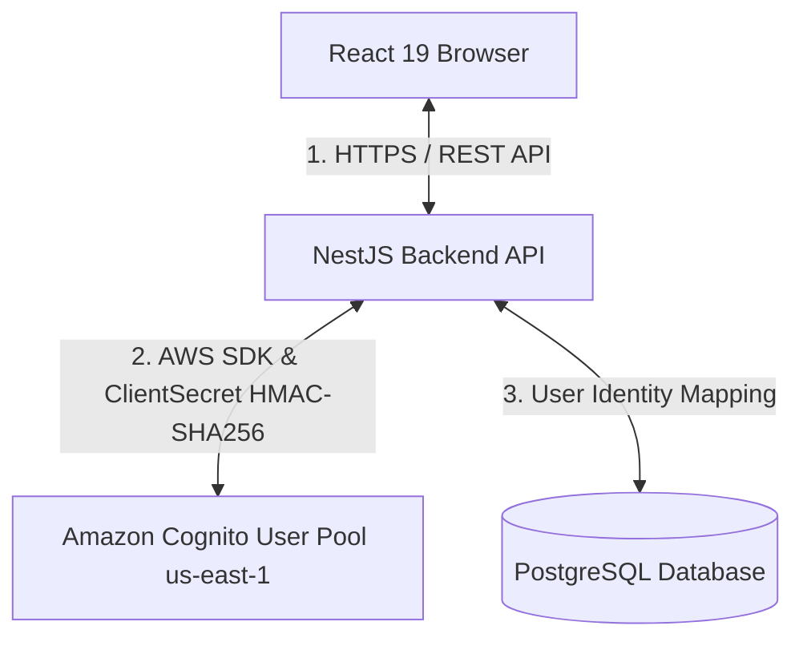
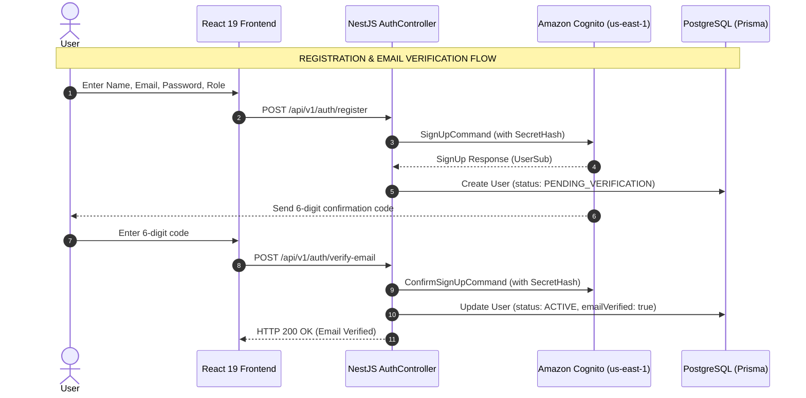

# BUILDING SECURE AUTHENTICATION WITH AMAZON COGNITO FOR A REACT AND NESTJS APPLICATION
## Cloud Authentication Architecture for Full-Stack Applications

### 1. Introduction
In modern web application design, identity management and user authentication are critical components that carry significant security implications.

For the **Startups Blogs** platform (connecting Startups, Business Owners, Investors, and Enterprise Partners), investment profiles and financial data require robust protection. Rather than building custom password storage and hashing mechanisms in an internal database, the project adopted **Amazon Cognito User Pool** in the `us-east-1` region as its identity management solution.

This article details how **Amazon Cognito** is integrated into a Full-Stack architecture consisting of **React 19 (Vite, TypeScript)** on the frontend, **NestJS REST API** on the backend, and **PostgreSQL (Prisma ORM)** database.

---

### 2. Why Route Requests Through NestJS Backend Instead of Calling Cognito Directly?

A core architectural decision in Startups Blogs is **never invoking the Amazon Cognito SDK directly from the React browser client**. All authentication flows (Register, Verify Email, Login, Refresh, Password Reset) are proxied through **NestJS Backend Controllers**.

#### Core Technical Rationale:
1. **Absolute Cognito Client Secret Protection**:
   To prevent client spoofing, the Cognito App Client is configured as a **Confidential Client** requiring a `Client Secret`. If a React Single Page Application (SPA) calls Cognito directly, the `Client Secret` would have to be embedded in browser JavaScript, making it easily extractable. By routing through NestJS, the `Client Secret` stays protected in the server environment (`process.env.COGNITO_CLIENT_SECRET`).
2. **Elimination of Client-Side Token Storage Vulnerabilities (XSS Protection)**:
   If React called Cognito directly, issued tokens (`AccessToken`, `IdToken`, `RefreshToken`) would typically be stored in `localStorage` or `sessionStorage`, exposing them to Cross-Site Scripting (XSS) attacks. With NestJS acting as a secure proxy, tokens are stored in **HttpOnly Signed Cookies** inaccessible to JavaScript.
3. **Identity Synchronization with Domain Database**:
   Users in Startups Blogs require application domain attributes (`role`: `BUSINESS_OWNER`, `INVESTOR`, `ENTERPRISE_PARTNER`, company profiles) stored in PostgreSQL. Routing through NestJS allows **Atomic Transactions**: registering with Cognito while simultaneously provisioning a matching `User` record in PostgreSQL linked by a unique `cognitoSub`.

---

### 3. End-to-End Authentication Flows

#### A. Public Registration Boundary
- **Role Boundary**: Public registration is strictly restricted to `BUSINESS_OWNER`, `INVESTOR`, and `ENTERPRISE_PARTNER`. The `ADMIN` role is managed internally and **not publicly registrable**.
- When a user submits registration, NestJS receives the request at `AuthController.register()` and calls `CognitoService.signUp()`.
- Cognito automatically dispatches a 6-digit verification code to the user's email address.
- NestJS creates a corresponding `User` record in PostgreSQL with status `PENDING_VERIFICATION`.

#### B. Email Verification Flow
- The user enters the 6-digit code at `VerifyEmail.tsx`.
- NestJS receives the request at `AuthController.verifyEmail()` and issues `ConfirmSignUpCommand` to Cognito.
- Upon successful verification, NestJS updates the user record in PostgreSQL to `ACTIVE` and `emailVerified: true`.

#### C. Login & Session Creation Flow
- The user submits credentials at `Login.tsx`.
- NestJS computes `SECRET_HASH` via HMAC-SHA256 using `COGNITO_CLIENT_SECRET` and sends `InitiateAuthCommand` (`USER_PASSWORD_AUTH`).
- Upon credential validation, Cognito issues `AccessToken`, `IdToken`, and `RefreshToken`.
- NestJS packages these tokens into **HttpOnly Signed Cookies** returned to the browser.

---

### 4. Conclusion
By proxying all authentication requests through the NestJS backend, **Startups Blogs** achieves robust cloud identity integration:
- Keeps `COGNITO_CLIENT_SECRET` isolated on the server.
- Prevents token exposure to XSS via HttpOnly Signed Cookies.
- Ensures consistency between cloud identity and PostgreSQL application data.

---

### 💬 Discussion

Where do you usually store your tokens when handling Auth—in `localStorage` or `Cookies`? Let's discuss and share your thoughts on my Facebook post!

👉 **[Join the discussion on the Facebook post here](https://www.facebook.com/groups/awsstudygroupfcj/posts/2242620649836228/)**

*#AWS #AmazonCognito #ReactJS #NestJS #WebSecurity #SoftwareArchitecture #Fullstack #DevOps #FrontendDev #WebDevelopment*