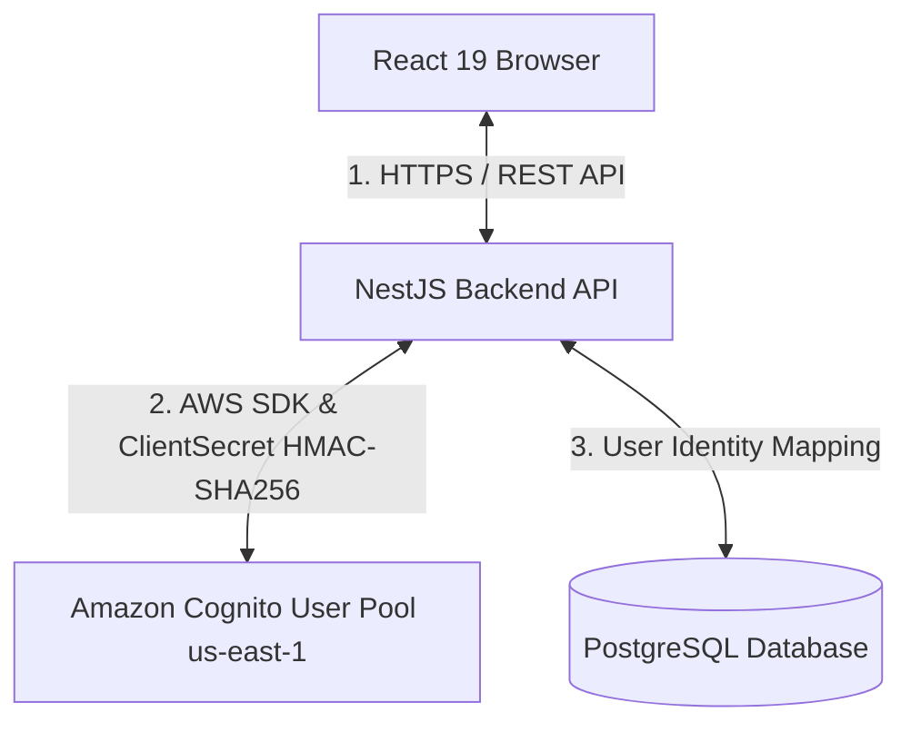
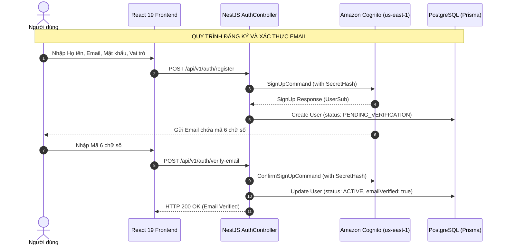

# BUILDING SECURE AUTHENTICATION WITH AMAZON COGNITO FOR A REACT AND NESTJS APPLICATION
## Thách thức & Giải pháp Xây dựng Hệ thống Xác thực Đám mây Bảo mật cho Ứng dụng Full-Stack

<i>Hình: Amazon Cognito & React</i>

### 1. Giới thiệu bài viết
Trong thiết kế ứng dụng web hiện đại, quản lý danh tính (Identity Management) và xác thực người dùng là một trong những thành phần quan trọng nhất nhưng cũng tiềm ẩn nhiều rủi ro an ninh mạng.

Đối với nền tảng **Startups Blogs** (Nền tảng kết nối các Doanh nghiệp khởi nghiệp, Chủ doanh nghiệp, Nhà đầu tư và Đối tác chiến lược), thông tin về hồ sơ đầu tư và danh mục tài chính chứa nhiều thông tin nhạy cảm. Vì vậy, thay vì tự xây dựng cơ chế quản lý mật khẩu và mã hóa trong cơ sở dữ liệu nội bộ, hệ thống lựa chọn **Amazon Cognito User Pool** tại khu vực `us-east-1` làm giải pháp ủy quyền quản lý danh tính.

Bài viết này trình bày chi tiết cách tích hợp **Amazon Cognito** vào mô hình kiến trúc Full-Stack bao gồm **React 19 (Vite, TypeScript)** ở Frontend, **NestJS REST API** ở Backend và cơ sở dữ liệu **PostgreSQL (Prisma ORM)**.

---

### 2. Tại sao lại gửi request qua NestJS Backend thay vì gọi trực tiếp Cognito từ Trình duyệt?

Một trong những quyết định kiến trúc quan trọng nhất của Startups Blogs là **không bao giờ gọi trực tiếp Amazon Cognito SDK từ trình duyệt React**. Tất cả các thao tác xác thực (Đăng ký, Xác thực Email, Đăng nhập, Làm mới phiên, Đặt lại mật khẩu) đều được điều hướng qua **NestJS Backend Controller**.

#### Lý do kỹ thuật cốt lõi:
1. **Bảo vệ tuyệt đối Cognito Client Secret**:
   Để ngăn chặn nguy cơ giả mạo client, Cognito App Client được cấu hình ở chế độ **Confidential Client** kèm theo một `Client Secret`. Nếu ứng dụng Single Page Application (SPA) React gọi trực tiếp Cognito, `Client Secret` bắt buộc phải nhúng vào mã nguồn JavaScript phía client và có thể bị trích xuất dễ dàng qua Developer Tools. Khi gọi qua NestJS Backend, `Client Secret` được giữ an toàn trong môi trường Server (`process.env.COGNITO_CLIENT_SECRET`).
2. **Loại bỏ rủi ro lưu trữ Token tại Client (Prevent XSS)**:
   Nếu React gọi Cognito trực tiếp, các token trả về (`AccessToken`, `IdToken`, `RefreshToken`) thường phải lưu trong `localStorage` hoặc `sessionStorage` của trình duyệt. Điều này khiến token dễ bị tấn công và đánh cắp thông qua lỗ hổng Cross-Site Scripting (XSS). Với kiến trúc trung gian NestJS, các token này được lưu trong **HttpOnly Signed Cookies** không thể truy cập từ JavaScript client.
3. **Đồng bộ Dữ liệu Danh tính với Cơ sở dữ liệu Nghiệp vụ**:
   Mỗi người dùng trong Startups Blogs cần lưu giữ các thuộc tính nghiệp vụ mở rộng (như `role`: `BUSINESS_OWNER`, `INVESTOR`, `ENTERPRISE_PARTNER`, trạng thái hồ sơ, thông tin công ty...) tại PostgreSQL. Việc NestJS đứng ở giữa giúp thực hiện thao tác **Atomic Transaction**: vừa đăng ký/xác thực tài khoản với Cognito, vừa khởi tạo bản ghi `User` tương ứng trong PostgreSQL với `cognitoSub` độc nhất.

---

### 3. Kiến trúc Luồng Xác thực Toàn diện (End-to-End Authentication Flows)

#### A. Quy trình Đăng ký Công khai (Public Registration)
- **Ranh giới Phân quyền Đăng ký**: Đăng ký công khai trên giao diện web chỉ giới hạn cho 3 vai trò: `BUSINESS_OWNER`, `INVESTOR`, và `ENTERPRISE_PARTNER`. Vai trò `ADMIN` được quản lý và cấp phát nội bộ, **không mở đăng ký công khai**.
- Khi người dùng gửi form đăng ký, NestJS nhận request tại `AuthController.register()` và gọi `CognitoService.signUp()`.
- Cognito tự động gửi một email kích hoạt chứa mã 6 chữ số đến địa chỉ email của người dùng.
- Đồng thời, NestJS tạo bản ghi `User` trong cơ sở dữ liệu PostgreSQL với trạng thái `PENDING_VERIFICATION`.

#### B. Quy trình Xác thực Email (Email Verification)
- Người dùng nhập mã 6 chữ số tại giao diện `VerifyEmail.tsx`.
- NestJS nhận request tại `AuthController.verifyEmail()` và gửi lệnh `ConfirmSignUpCommand` tới Cognito.
- Khi Cognito xác nhận mã hợp lệ, NestJS cập nhật trạng thái người dùng trong PostgreSQL thành `ACTIVE` và `emailVerified: true`.

#### C. Quy trình Đăng nhập & Tạo Session (Login & Session Creation)
- Người dùng nhập Email và Mật khẩu tại `Login.tsx`.
- NestJS tính toán `SECRET_HASH` bằng thuật toán HMAC-SHA256 với `COGNITO_CLIENT_SECRET` và gọi lệnh `InitiateAuthCommand` với luồng `USER_PASSWORD_AUTH`.
- Khi Cognito xác thực credentials thành công, Cognito trả về các token: `AccessToken`, `IdToken`, `RefreshToken`.
- NestJS không trả token về JSON body mà đóng gói chúng vào **HttpOnly Signed Cookies** và gửi về trình duyệt.

---

### 4. Kết luận
Bằng cách định tuyến tất cả request xác thực qua NestJS Backend, dự án **Startups Blogs** đã giải quyết triệt để vấn đề an toàn bảo mật khi tích hợp Amazon Cognito:
- Giữ kín `COGNITO_CLIENT_SECRET` trên Server.
- Ngăn chặn triệt để nguy cơ lộ token qua tấn công XSS nhờ HttpOnly Signed Cookies.
- Đảm bảo sự đồng bộ nhất quán giữa danh tính đám mây Cognito và cơ sở dữ liệu ứng dụng PostgreSQL.

Trong bài viết tiếp theo (Blog 2), em sẽ đi sâu vào kỹ thuật tính toán **SecretHash HMAC-SHA256** và cơ chế thẩm định chữ ký RSA của JWT bằng **`aws-jwt-verify`**.

---

### 💬 Thảo luận

Mọi người thường xử lý Auth lưu token ở `localStorage` hay `Cookies`? Cùng thảo luận và chia sẻ ý kiến với em dưới phần bình luận nhé!

👉 **[Tham gia thảo luận trên bài đăng Facebook tại đây](https://www.facebook.com/groups/awsstudygroupfcj/posts/2242620649836228/)**

*#AWS #AmazonCognito #ReactJS #NestJS #WebSecurity #SoftwareArchitecture #Fullstack #DevOps #FrontendDev #WebDevelopment*