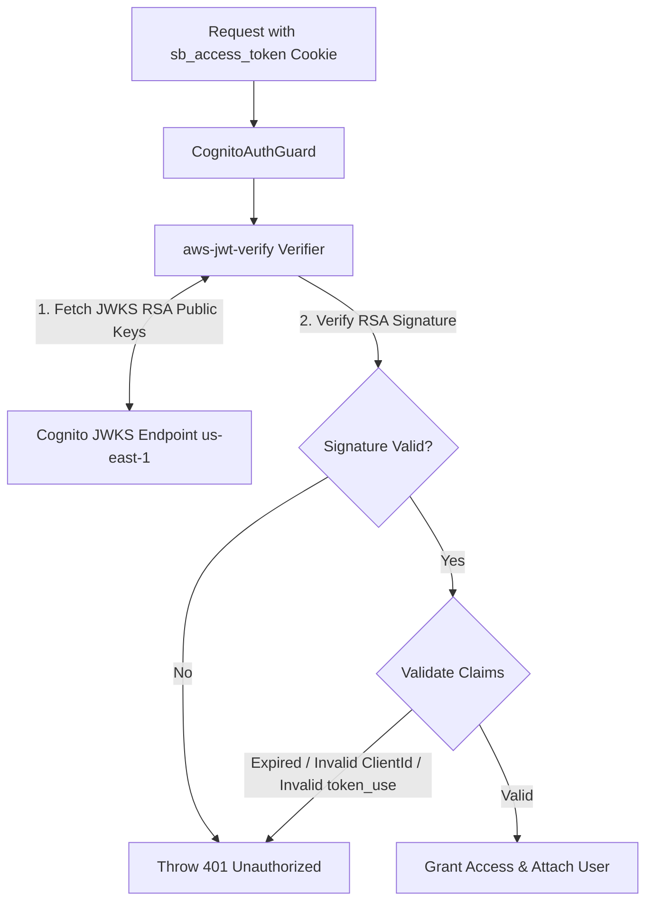

# SECURING AMAZON COGNITO AUTHENTICATION WITH SECRETHASH AND JWT VERIFICATION IN NESTJS
## Securing Backend Infrastructure with SecretHash HMAC-SHA256 and RSA JWT Signature Verification (`us-east-1`)


### 1. Introduction
When using **Amazon Cognito Confidential App Clients** in enterprise applications, securing communications between the backend server and Cognito User Pools requires strict cryptographic validation.

This article analyzes two core security mechanisms implemented in the NestJS backend of **Startups Blogs**:
1. **Cognito SecretHash Algorithm (HMAC-SHA256)** applied to AWS SDK authentication commands.
2. **JWT Cryptographic RSA Signature Verification using `aws-jwt-verify`**, explaining why simple JWT decoding is insufficient.

---

### 2. Computing Cognito SecretHash with HMAC-SHA256

When a Cognito App Client is created with a `Client Secret`, Cognito requires all authentication commands (`SignUp`, `ConfirmSignUp`, `InitiateAuth`, `ForgotPassword`) to pass a `SECRET_HASH` parameter.

#### Mathematical Formula & Algorithm
`SecretHash` is a Base64-encoded string generated via **HMAC-SHA256**:
- **Key**: `COGNITO_CLIENT_SECRET` (App Client Secret).
- **Message**: Concatenation of `Username` (User Email) and `COGNITO_CLIENT_ID`.

$$\text{SecretHash} = \text{Base64}\left( \text{HMAC-SHA256}\left( \text{ClientSecret}, \text{Username} + \text{ClientId} \right) \right)$$

#### Implementation in NestJS Source Code (`cognito-secret-hash.ts`)
```typescript
import * as crypto from 'crypto';

export function generateCognitoSecretHash(
  username: string, 
  clientId: string, 
  clientSecret: string
): string {
  return crypto
    .createHmac('SHA256', clientSecret)
    .update(username + clientId)
    .digest('base64');
}
```

#### Application in `CognitoService`
Before sending AWS SDK commands (such as `InitiateAuthCommand` with `USER_PASSWORD_AUTH`), NestJS calls `getSecretHash(email)` and passes it in `AuthParameters`:

```typescript
async login(email: string, password: string): Promise<CognitoTokens> {
  const secretHash = this.getSecretHash(email);
  const command = new InitiateAuthCommand({
    AuthFlow: AuthFlowType.USER_PASSWORD_AUTH,
    ClientId: this.clientId,
    AuthParameters: {
      USERNAME: email,
      PASSWORD: password,
      SECRET_HASH: secretHash,
    },
  });

  const response = await this.cognitoClient.send(command);
  // Returns AccessToken, IdToken, RefreshToken
}
```

---

### 3. RSA JWT Signature Verification via `aws-jwt-verify`

When a client sends an authentication token to NestJS, the server must verify whether the token was legitimately issued by the **Amazon Cognito User Pool** in `us-east-1`.

#### Why Pure JWT Decoding (`jwt.decode()`) is Dangerous
Relying solely on `jwt.decode()` is a critical security flaw:
- **Decoding** merely converts Base64Url strings to JSON without verifying integrity or origin.
- Attackers could craft malicious JSON payloads with arbitrary `sub` or `email` fields. If the server does not verify signatures, system access is compromised.

#### RSA Signature Verification via JWKS (JSON Web Key Set)
Cognito JWT signatures use asymmetric **RS256** (RSA Signature with SHA-256):
- Cognito publishes public keys at standard JWKS endpoints:
  `https://cognito-idp.us-east-1.amazonaws.com/<userPoolId>/.well-known/jwks.json`
- To verify tokens, the backend fetches JWKS keys matching the token `kid` (Key ID) header and validates the RSA signature.



#### NestJS Verification Implementation (`cognito.service.ts` & `cognito-auth.guard.ts`)
The **Startups Blogs** backend uses `aws-jwt-verify` to automate JWKS caching and validate 5 security requirements:

1. **RSA Signature**: Ensures the token was signed by the legitimate Cognito User Pool.
2. **Expiration (`exp`)**: Validates token expiration timestamps.
3. **Token Use (`token_use`)**: Ensures `token_use === 'access'`.
4. **App Client ID (`client_id`)**: Matches the system `COGNITO_CLIENT_ID`.
5. **Issuer (`iss`)**: Matches the Cognito `us-east-1` issuer URL.

```typescript
// Inside CognitoService
this.jwtVerifier = CognitoJwtVerifier.create({
  userPoolId: this.userPoolId,
  tokenUse: 'access',
  clientId: this.clientId,
});
```

---

### 4. Conclusion
Combining **SecretHash (HMAC-SHA256)** for outbound SDK requests and **`aws-jwt-verify` (RSA JWKS Verification `us-east-1`)** for incoming REST requests ensures maximum security:
- Client secret remains protected.
- Prevents JWT token tampering.
- Secures restricted endpoints such as capital raising operations.

---

### 💬 Discussion

Which library do you usually use to verify JWT Tokens in your real-world projects? Let's discuss and share your thoughts on my Facebook post!

👉 **[Join the discussion on the Facebook post here](https://www.facebook.com/groups/awsstudygroupfcj/posts/2242621059836187/)**

*#AWS #AmazonCognito #NestJS #ReactJS #WebSecurity #JWT #HMAC #SoftwareArchitecture #BackendDevelopment #CyberSecurity*