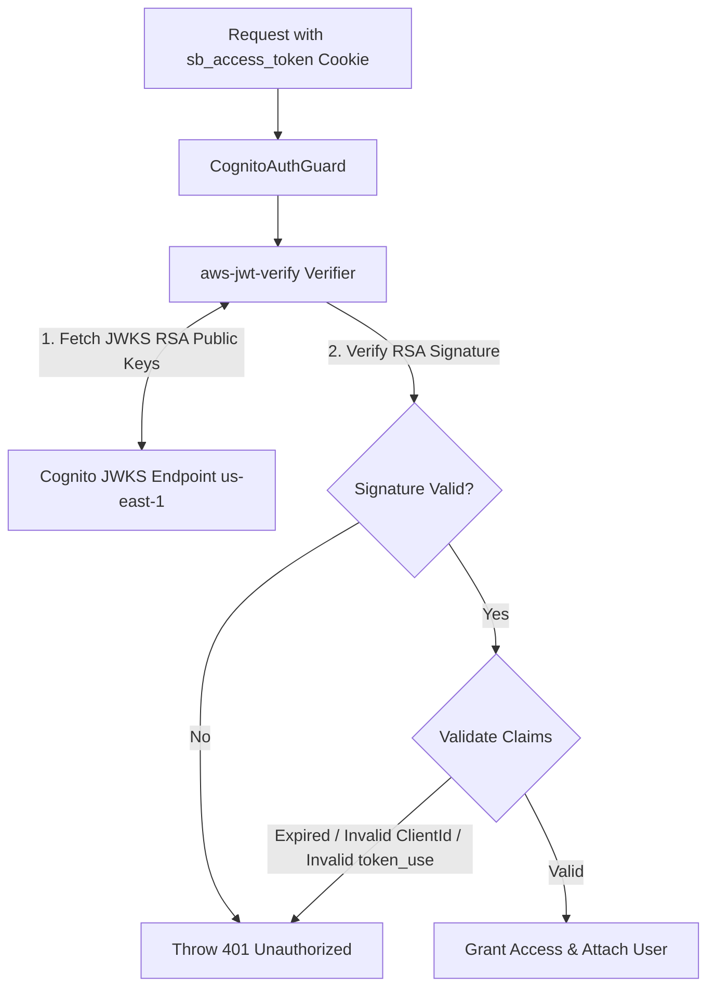

# SECURING AMAZON COGNITO AUTHENTICATION WITH SECRETHASH AND JWT VERIFICATION IN NESTJS
## Đảm bảo An toàn Tuyệt đối cho Backend với SecretHash HMAC-SHA256 và Thẩm định Chữ ký RSA JWT (`us-east-1`)


<p align="center"><i>Hình: Bảo mật Cognito</i></p>


### 1. Giới thiệu bài viết
Trong các ứng dụng doanh nghiệp sử dụng **Amazon Cognito Confidential App Client**, việc bảo vệ giao tiếp giữa Backend Server và Cognito User Pool đòi hỏi các cơ chế mã hóa và thẩm định nghiêm ngặt.

Bài viết này tập trung phân tích 2 kỹ thuật bảo mật cốt lõi được triển khai trong Backend NestJS của dự án **Startups Blogs**:
1. **Thuật toán tính toán Cognito SecretHash (HMAC-SHA256)** khi thực thi các lệnh API của Cognito SDK.
2. **Cơ chế kiểm tra và thẩm định chữ ký JWT bằng `aws-jwt-verify`**, giải thích lý do tại sao việc decode chuỗi JWT là chưa đủ để bảo vệ hệ thống.

---

### 2. Tính toán Cognito SecretHash với HMAC-SHA256

Khi một App Client trong Amazon Cognito được cấu hình kèm theo `Client Secret`, Cognito yêu cầu mọi request xác thực (như `SignUp`, `ConfirmSignUp`, `InitiateAuth`, `ForgotPassword`) phải gửi kèm thuộc tính `SECRET_HASH`.

#### Công thức toán học & Thuật toán
`SecretHash` là một chuỗi Base64 tạo bởi thuật toán mã hóa **HMAC-SHA256**, trong đó:
- **Key**: `COGNITO_CLIENT_SECRET` (Khóa bí mật của App Client).
- **Message**: Chuỗi kết hợp giữa `Username` (Email của người dùng) và `COGNITO_CLIENT_ID`.

$$\text{SecretHash} = \text{Base64}\left( \text{HMAC-SHA256}\left( \text{ClientSecret}, \text{Username} + \text{ClientId} \right) \right)$$

#### Triển khai thực tế trong mã nguồn NestJS (`cognito-secret-hash.ts`)
```typescript
import * as crypto from 'crypto';

export function generateCognitoSecretHash(
  username: string, 
  clientId: string, 
  clientSecret: string
): string {
  return crypto
    .createHmac('SHA256', clientSecret)
    .update(username + clientId)
    .digest('base64');
}
```

#### Ứng dụng trong `CognitoService`
Trước mỗi lệnh gọi AWS SDK (như `InitiateAuthCommand` với `USER_PASSWORD_AUTH`), NestJS gọi hàm `getSecretHash(email)` để tính toán hash và truyền vào `AuthParameters`:

```typescript
async login(email: string, password: string): Promise<CognitoTokens> {
  const secretHash = this.getSecretHash(email);
  const command = new InitiateAuthCommand({
    AuthFlow: AuthFlowType.USER_PASSWORD_AUTH,
    ClientId: this.clientId,
    AuthParameters: {
      USERNAME: email,
      PASSWORD: password,
      SECRET_HASH: secretHash,
    },
  });

  const response = await this.cognitoClient.send(command);
  // Tra cứu và trả về AccessToken, IdToken, RefreshToken
}
```

---

### 3. Thẩm định Chữ ký JWT với `aws-jwt-verify`

Khi client gửi request chứa token xác thực đến Backend NestJS, Backend phải thẩm định xem token này có thực sự do **Amazon Cognito User Pool** (`us-east-1`) phát hành hay không.

#### Tại sao việc Decode JWT đơn thuần (`jwt.decode()`) là NGUY HIỂM?
Nhiều lập trình viên mắc sai lầm khi chỉ dùng `jwt.decode()` hoặc `JSON.parse(atob(token.split('.')[1]))` để lấy dữ liệu payload. 
- **Giải mã (Decode)** chỉ là việc chuyển đổi chuỗi Base64Url sang JSON, **hoàn toàn không xác minh tính toàn vẹn hay nguồn gốc**.
- Tấn công giả mạo có thể tự tạo một chuỗi JSON với bất kỳ `sub` hay `email` nào, mã hóa Base64 và gửi lên Server. Nếu Server chỉ decode mà không xác thực chữ ký (Signature Verification), hệ thống sẽ bị xâm nhập hoàn toàn.

#### Cơ chế Thẩm định Chữ ký RSA với JWKS (JSON Web Key Set)
Chữ ký của Cognito JWT được ký bằng thuật toán mã hóa bất đối xứng **RS256** (RSA Signature with SHA-256).
- Cognito công bố các khóa công khai (Public Keys) tại đường dẫn JWKS tiêu chuẩn:
  `https://cognito-idp.us-east-1.amazonaws.com/<userPoolId>/.well-known/jwks.json`
- Để thẩm định token, Backend phải tải JWKS, chọn đúng `kid` (Key ID) trùng với header của token, và dùng Public Key để kiểm tra chữ ký RSA.



#### Triển khai Thẩm định trong NestJS Backend (`cognito.service.ts` & `cognito-auth.guard.ts`)
Dự án **Startups Blogs** sử dụng thư viện chính thức `aws-jwt-verify` từ AWS để tự động hóa việc caching JWKS và kiểm tra 5 tiêu chuẩn an toàn:

1. **Chữ ký RSA (RSA Signature)**: Đảm bảo token được ký bởi Cognito User Pool chính chủ.
2. **Thời hạn hiệu lực (Expiration `exp`)**: Đảm bảo token chưa hết hạn sử dụng.
3. **Mục đích sử dụng Token (`token_use`)**: Xác minh `token_use === 'access'`.
4. **App Client Identifier (`client_id`)**: Khớp đúng với `COGNITO_CLIENT_ID` của hệ thống.
5. **Issuer (`iss`)**: Khớp đúng với URL issuer của Cognito Region `us-east-1`.

```typescript
// Trong CognitoService (Khởi tạo Verifier)
this.jwtVerifier = CognitoJwtVerifier.create({
  userPoolId: this.userPoolId,
  tokenUse: 'access',
  clientId: this.clientId,
});

// Trong CognitoAuthGuard
async canActivate(context: ExecutionContext): Promise<boolean> {
  const request = context.switchToHttp().getRequest();
  const accessToken = request.signedCookies?.sb_access_token || request.cookies?.sb_access_token;

  if (!accessToken) {
    throw new UnauthorizedException('Access token missing');
  }

  try {
    // Thẩm định chữ ký RSA và các claims an toàn
    const payload = await this.cognitoService.verifyAccessToken(accessToken);
    
    // Đọc thông tin người dùng an toàn từ PostgreSQL
    const user = await this.prisma.user.findUnique({
      where: { email: payload.username },
    });

    request.user = user;
    return true;
  } catch (error) {
    throw new UnauthorizedException('Invalid or expired authentication token');
  }
}
```

---

### 4. Kết luận
Việc kết hợp **SecretHash (HMAC-SHA256)** ở chiều gửi request tới Cognito và **`aws-jwt-verify` (RSA JWKS Verification `us-east-1`)** ở chiều nhận request tại NestJS Backend giúp nền tảng **Startups Blogs** đạt chuẩn bảo mật cao nhất:
- Không lộ Client Secret.
- Chống tuyệt đối hành vi giả mạo JWT Token.
- Bảo vệ các tuyến đường dữ liệu quan trọng như đăng ký gọi vốn.

---

### 💬 Thảo luận

Mọi người trong dự án thực tế thường dùng thư viện nào để verify JWT Token? Cùng thảo luận và chia sẻ ý kiến với em dưới phần bình luận nhé!

👉 **[Tham gia thảo luận trên bài đăng Facebook tại đây](https://www.facebook.com/groups/awsstudygroupfcj/posts/2242621059836187/)**

*#AWS #AmazonCognito #NestJS #ReactJS #WebSecurity #JWT #HMAC #SoftwareArchitecture #BackendDevelopment #CyberSecurity*