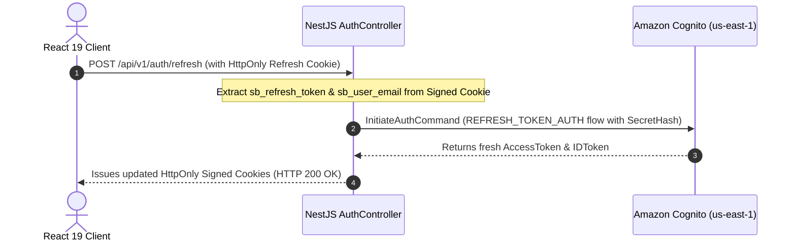

# MANAGING AMAZON COGNITO SESSIONS WITH HTTPONLY COOKIES, REFRESH TOKENS, AND ROLE-BASED ACCESS CONTROL
## Enterprise Session Management and Role-Based Authorization (`us-east-1`)


### 1. Introduction
Following successful user credential authentication with **Amazon Cognito**, the next consideration is: *How to maintain and manage user sessions securely?*

For Single Page Applications (SPAs) built with React, storing JWT Access or Refresh Tokens in `localStorage` exposes user accounts to severe risks from **Cross-Site Scripting (XSS)** vulnerabilities.

This article highlights the session management architecture implemented in **Startups Blogs**:
- Storing Tokens in **HttpOnly Signed Cookies**.
- Maintaining active sessions via **Refresh Token (`REFRESH_TOKEN_AUTH`)**.
- Handling Global SignOut and Token Revocation.
- Combining Cognito authentication with **Role-Based Access Control (RBAC)** in PostgreSQL to protect capital-raising and administrative routes.

---

### 2. Session Security with HttpOnly Signed Cookies

Instead of returning tokens to browser storage, NestJS packages Cognito tokens inside **HttpOnly Signed Cookies** with strict security flags:

```typescript
// Inside AuthController.ts
private getCookieOptions(maxAgeMs?: number) {
  return {
    httpOnly: true,                                         // Inaccessible to client JavaScript
    secure: process.env.COOKIE_SECURE === 'true',           // Enforces HTTPS in production
    sameSite: (process.env.COOKIE_SAME_SITE as any) || 'lax',// Prevents CSRF attacks
    path: '/',
    signed: true,                                           // Signed with secret key against tampering
    ...(maxAgeMs !== undefined && { maxAge: maxAgeMs }),
  };
}
```

#### Token Storage Comparison: `localStorage` vs `HttpOnly Cookie`

| Comparison Criteria | Browser `localStorage` | Server-Side HttpOnly Cookie |
| --- | :---: | :---: |
| JavaScript Extractable (`document.cookie`) | ⚠️ Yes (Vulnerable) | ✅ No (Strictly Isolated) |
| XSS Token Theft Risk | ⚠️ Critical | ✅ Immune to XSS Read |
| CSRF Mitigation | ✅ Via Custom Headers | ✅ Via `SameSite=Lax` & Signed Cookies |
| Automatic Transport | ❌ Requires JS Header Injection | ✅ Automatically attached by browser |

---

### 3. Session Refresh Flow

Cognito Access Tokens expire after 1 hour. Upon expiration, users do not need to re-enter credentials. The system automatically renews tokens via the `sb_refresh_token` cookie.



#### Logout & Token Revocation
When a user logs out, NestJS executes:
1. Dispatches `RevokeTokenCommand` and `GlobalSignOutCommand` to Cognito to invalidate the Refresh Token on AWS.
2. Clears all HttpOnly cookies on the browser via `response.clearCookie()`.

---

### 4. Combining Cognito with RBAC & Cognito Groups in PostgreSQL

In **Startups Blogs**, Cognito acts as the Identity Provider while **PostgreSQL** maintains application domain roles (`UserRole` enum):
- `BUSINESS_OWNER`: Business Founder.
- `INVESTOR`: Investor.
- `ENTERPRISE_PARTNER`: Strategic Corporate Partner.
- `ADMIN`: System Administrator (**Synchronized with Cognito Group `ADMIN`**).

#### Capital Raising Protection (`ProtectedRoute`)
The `/raise-capital` route renders an 8-step wizard protected at both Frontend and Backend levels:

- **Frontend ProtectedRoute (`App.tsx`)**:
```tsx
<Route
  path="raise-capital"
  element={
    <ProtectedRoute allowedRoles={['BUSINESS_OWNER', 'ENTERPRISE_PARTNER']}>
      <RaiseCapital />
    </ProtectedRoute>
  }
/>
```

- **Implemented Functionality**:
  - Protected navigation route and 8-step Form Wizard.
  - Image logo and document attachment uploads to Amazon S3 (`POST /upload`).
  - Direct persistence into PostgreSQL database (`POST /businesses`, `POST /businesses/:businessId/funding-opportunities`).

---

### 5. Conclusion
Combining **HttpOnly Signed Cookies** with Amazon Cognito (`us-east-1`) **Refresh Token flows** and **PostgreSQL RBAC** achieves an optimal balance between **User Experience** and **Enterprise Security**.

---

### 💬 Discussion

How do you usually handle the logic of automatically calling a Refresh Token silently on the frontend to optimize UX without interrupting ongoing API calls? Let's discuss technical approaches in the comments!

👉 **[Join the discussion on the Facebook post here](https://www.facebook.com/groups/awsstudygroupfcj/posts/2243690619729231/)**

*#AWS #AmazonCognito #ReactJS #NestJS #WebSecurity #SessionManagement #RBAC #FrontendDev #WebDevelopment*