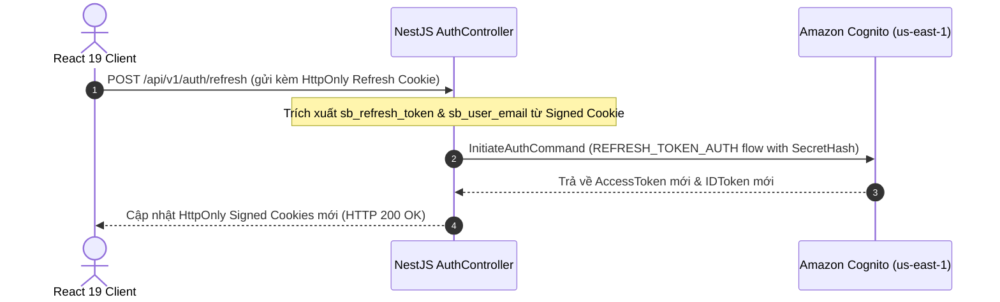

# MANAGING AMAZON COGNITO SESSIONS WITH HTTPONLY COOKIES, REFRESH TOKENS, AND ROLE-BASED ACCESS CONTROL
## Giải pháp Quản lý Phiên Đăng nhập An toàn và Phân quyền Người dùng Cấp Doanh nghiệp (`us-east-1`)


<p align="center"><i>Hình: Session Management & RBAC</i></p>


### 1. Giới thiệu bài viết
Sau khi xác thực thành công credentials của người dùng với **Amazon Cognito**, vấn đề tiếp theo là: *Làm thế nào để duy trì và quản lý phiên đăng nhập (Session Management) một cách an toàn nhất?*

Đối với các ứng dụng Single Page Application (SPA) viết bằng React, việc lưu trữ JWT Access Token hay Refresh Token trong `localStorage` là nguyên nhân hàng đầu dẫn đến nguy cơ mất tài khoản khi ứng dụng dính phải lỗ hổng **Cross-Site Scripting (XSS)**.

Bài viết này giới thiệu kiến trúc quản lý phiên làm việc được triển khai trong nền tảng **Startups Blogs**:
- Lưu trữ Token trong **HttpOnly Signed Cookies**.
- Duy trì phiên làm việc bằng cơ chế **Refresh Token (`REFRESH_TOKEN_AUTH`)**.
- Xử lý Đăng xuất và Revoke Token.
- Kết hợp xác thực Cognito với **Role-Based Access Control (RBAC)** trong cơ sở dữ liệu PostgreSQL để bảo vệ các tuyến đường gọi vốn và quản trị.

---

### 2. An toàn Phiên với HttpOnly Signed Cookies

Thay vì trả token về client để React tự lưu vào `localStorage`, Backend NestJS đóng gói các token thu được từ Cognito vào **HttpOnly Signed Cookies** với cấu hình thuộc tính bảo mật cao:

```typescript
// Trong AuthController.ts
private getCookieOptions(maxAgeMs?: number) {
  return {
    httpOnly: true,                                         // Ngăn JavaScript (document.cookie) truy cập token
    secure: process.env.COOKIE_SECURE === 'true',           // Bắt buộc HTTPS trên môi trường Production
    sameSite: (process.env.COOKIE_SAME_SITE as any) || 'lax',// Ngăn chặn Cross-Site Request Forgery (CSRF)
    path: '/',
    signed: true,                                           // Ký cookie bằng secret key để chống chỉnh sửa
    ...(maxAgeMs !== undefined && { maxAge: maxAgeMs }),
  };
}
```

#### So sánh Lưu trữ Token: `localStorage` vs `HttpOnly Cookie`

| Tiêu chí So sánh | Browser `localStorage` | Server-side HttpOnly Cookie |
| --- | :---: | :---: |
| Trích xuất được qua JavaScript (`document.cookie`) | ⚠️ Có (Rất nguy hiểm) | ✅ Không (Bảo vệ tuyệt đối) |
| Độc hại XSS đánh cắp Token | ⚠️ Rất cao | ✅ Miễn nhiễm với XSS read |
| Chống tấn công CSRF | ✅ Tự nhiên nếu gửi Header | ✅ Bảo vệ qua `SameSite=Lax` & Signed Cookie |
| Tự động gửi kèm Request | ❌ Phải viết mã JS đính kèm Header | ✅ Trình duyệt tự động đính kèm theo domain |

---

### 3. Quy trình Làm mới Phiên (Refresh Token Flow)

Cognito Access Token mặc định có thời hạn 1 giờ. Khi Access Token hết hạn, người dùng không cần phải nhập lại mật khẩu. Hệ thống sẽ tự động gia hạn token thông qua `sb_refresh_token` cookie.



#### Đăng xuất & Thu hồi Token (Global SignOut & RevokeToken)
Khi người dùng chọn **Logout**, Backend NestJS thực hiện 2 thao tác:
1. Gửi lệnh `RevokeTokenCommand` và `GlobalSignOutCommand` tới Cognito để hủy hiệu lực của Refresh Token trên Đám mây.
2. Xóa toàn bộ HttpOnly Cookies trên Trình duyệt bằng `response.clearCookie()`.

---

### 4. Kết hợp Cognito với Phân quyền RBAC trong PostgreSQL & Cognito Groups

Trong **Startups Blogs**, Cognito đóng vai trò làm Nhà cung cấp Danh tính (Identity Provider), trong khi **PostgreSQL** lưu trữ vai trò nghiệp vụ của người dùng (`UserRole` enum):
- `BUSINESS_OWNER`: Chủ doanh nghiệp / Founder.
- `INVESTOR`: Nhà đầu tư.
- `ENTERPRISE_PARTNER`: Đối tác doanh nghiệp.
- `ADMIN`: Quản trị viên hệ thống (**Đồng bộ tự động qua Cognito Group `ADMIN`**).

#### Bảo vệ Tuyến đường Gọi vốn (Raise Capital Guard)
Tuyến đường `/raise-capital` hiển thị Wizard 8 bước lập hồ sơ gọi vốn. Tuyến đường này được bảo vệ ở cả Frontend và Backend:

- **Frontend ProtectedRoute (`App.tsx`)**:
```tsx
<Route
  path="raise-capital"
  element={
    <ProtectedRoute allowedRoles={['BUSINESS_OWNER', 'ENTERPRISE_PARTNER']}>
      <RaiseCapital />
    </ProtectedRoute>
  }
/>
```

- **Tính năng Đã Triển khai (Implemented)**:
  - Tuyến đường bảo vệ `ProtectedRoute`, giao diện Form Wizard 8 bước.
  - Tải ảnh đại diện và tài liệu đính kèm lên Amazon S3 (`POST /upload`).
  - Lưu và ghi dữ liệu gọi vốn trực tiếp vào cơ sở dữ liệu PostgreSQL (`POST /businesses`, `POST /businesses/:businessId/funding-opportunities`).

---

### 5. Kết luận
Giải pháp quản lý phiên bằng **HttpOnly Signed Cookies** kết hợp luồng **Refresh Token** của Amazon Cognito (`us-east-1`) và hệ thống phân quyền **RBAC PostgreSQL** giúp **Startups Blogs** đạt được sự cân bằng hoàn hảo giữa **Trải nghiệm Người dùng (UX)** và **Bảo mật Cấp Doanh nghiệp (Enterprise Security)**.

---

### 💬 Thảo luận

Mọi người thường xử lý logic tự động gọi Refresh Token ngầm ở phía frontend như thế nào để tối ưu UX nhất mà không làm gián đoạn API đang gọi dở? Cùng thảo luận kỹ thuật ở dưới phần bình luận nhé.

👉 **[Tham gia thảo luận trên bài đăng Facebook tại đây](https://www.facebook.com/groups/awsstudygroupfcj/posts/2243690619729231/)**

*#AWS #AmazonCognito #ReactJS #NestJS #WebSecurity #SessionManagement #RBAC #FrontendDev #WebDevelopment*